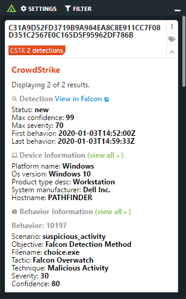

# Polarity CrowdStrike Integration

The Polarity CrowdStrike integration searches detections for MD5, SHA256 and MS windows executable filenames (EXE, DLL). The integration searches both IoCs and the triggering process hashes for detections. The integration also searches device information based on SHA256 and MD5 hashes.
 
> 
crowdstrike

## Creating a Client ID / Client Secret

Before using the Polarity CrowdStrike Integration you will need to create a Client ID and Client Secret to connect to CrowdStrike with. The following steps will guide you through the process:

1. Log onto the CrowdStrike Falcon console.
2. Go to `Support > API Client and Keys`.
3. Click `Add New API Client`.
4. A dialog will appear, enter the name of the integration (e.g. `Polarity`) and a description (optional).
5. Polarity will need the following permissions:
   
| Scope | Permission | Description |
| ------ | ------ | ------ |
| Detections | Read | Required to search detections |
| Hosts | Read, Write | Read access is required to search hosts by IP Address. Write permission is required if the "Allow Containment Status Change" option is checked |
| IOC Manager APIs | Read | Required if the "Search CrowdStrike IOCs" option is enabled | 

6. Click `Add`. Record the Client ID and Client Secret (Client secret will only be shown once for security purpose, so make sure to store it in a secure place).

Use the Client ID and Client Secret that you recorded previously to fill out the integration options. You are now ready to use the Polarity integration with Crowdstrike!

## Supported Searches

### Devices

Device lookup is supported by IP on both internal and external IP addresses

### IOCs

IOC lookups are supported for IP, MD5, SHA256 and domain entity types.

### Detections

Detection lookups are supported for IP, MD5, and SHA256 entity types

## CrowdStrike Integration Options

### CrowdStrike API URL

The REST API URL for your CrowdStrike instance which should include the schema (i.e., http, https) and port if required. Defaults to `https://api.crowdstrike.com`.

### Client ID
The Client ID to use to connect to CrowdStrike.

### Client Secret
The secret associated with the Client ID. At a minimum, the API key must have 'Read' access to the 'Detections' scope.

### Minimum Severity
The minimum severity level required for Detections or IOCs to be displayed. Defaults to `Low`.

### Detection Statuses
Detection statuses you would like to return results for. Defaults to `True Positive`, `In Progress` and `New`.

### Search CrowdStrike-IOC
If checked, the integration will search IOCs detected in your environment. IOCs (indicators of compromise) are artifacts that include SHA256, MD5 or domain values. The provided API key must have 'Read' access to the 'IOC Manager APIs' scope for this option to work.

### Allow Containment Status Change
If checked, users will be able to change the Containment Status of Devices via the integration. The provided API key must have 'Read' and 'Write' access to the 'Hosts' scope for this option to work.

### Max Concurrent Search Requests
Maximum number of concurrent search requests (defaults to 20). Integration must be restarted after changing this option.

### Minimum Time Between Searches

Minimum amount of time in milliseconds between each entity search (defaults to 100). Integration must be restarted after changing this option.

## Polarity

Polarity is a memory-augmentation platform that improves and accelerates analyst decision making. For more information about the Polarity platform please see:

https://polarity.io/
